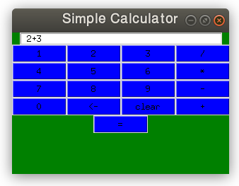
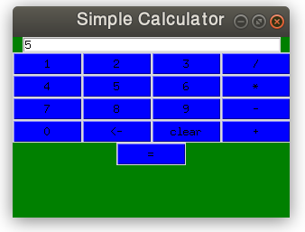

Simple Calculator

this is GUI based simple calculator using Python Tkinter module, it can perform basic arithmatic operations addition, subtraction, multiplication and division.

Input Expression

Result

use **clear** button to clear the whole expression or result

use **<-** to clear the last single input number, operator or result

### Runnig the App
    python simplecalculator.py
